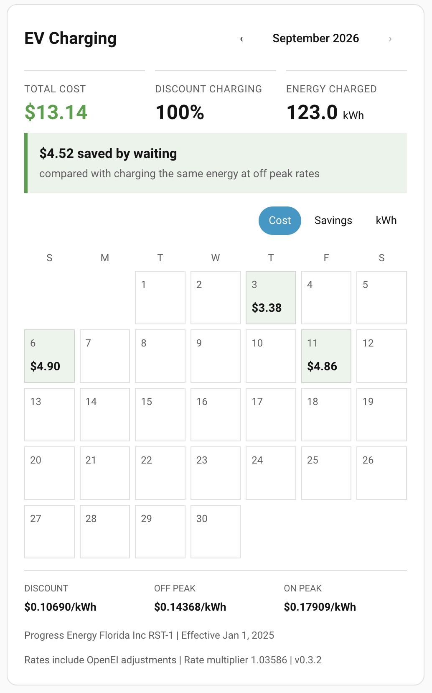
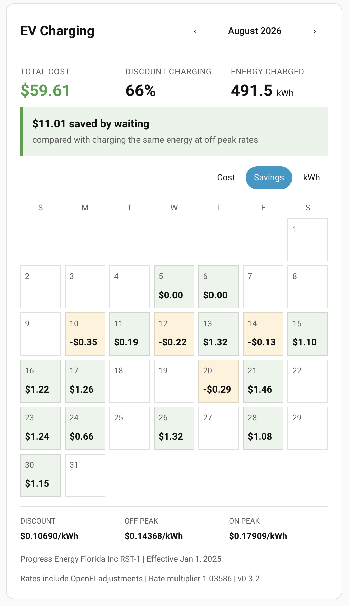

# EV Savings Card

A Home Assistant dashboard card showing monthly EV charging cost, discount-period charging percentage, and savings compared with charging the same energy at a selected rate.

The goal is to support any power company or supplied rate plan, and any charger or energy monitor that provides suitable energy history to Home Assistant. Tariff sources and charging equipment are independent choices; Duke is the first verified profile, and Emporia is not required.

[View both screenshots at 100% locally](docs/screenshots.html) (open the HTML file in a browser).

### Cost view



[Open Cost screenshot at original size](docs/images/ev-savings-card-cost.png)

### Savings view



[Open Savings screenshot at original size](docs/images/ev-savings-card-savings.png)

*Screenshots from Home Assistant, showing card v0.3.2. The 2× screenshots display here at half their pixel dimensions; original-resolution files remain available through the links above. The current build includes a more compact layout, manual rate setup, expandable charging details, and data-quality notices.*

## Manual rates and charging details (0.6.0)

Manual entry is now the default setup choice. Enter your utility and plan name, currency, service time zone, effective date, and final per-kWh prices in cents. For example, enter **10.74** for **$0.1074/kWh**. Include the variable fees and taxes you want counted in these prices; the integration adds no further tax factors or multipliers. Fixed household charges do not belong in a kWh scheduling price.

Choose a flat rate, custom time-of-use windows, or the optional Duke Florida RST-1 schedule preset. Flat plans use the discount/flat price all day; enter the same amount in the other price fields. Custom windows select months, weekdays/weekends, a discount or peak role, and whole-hour start/end boundaries. Unspecified hours are off peak. Split overnight windows into two rules. Custom schedules do not infer holidays; the Duke preset includes its seasonal and observed-holiday rules. Hourly statistics do not support exact pricing of half-hour tariff boundaries in this version.

For an existing installation, open **EV Savings → Configure**, select **Enter or update manual rates**, and complete the wizard. Updated prices must start on a future local date; earlier tariff snapshots remain in use for earlier dates. For an initial manual setup, choose the earliest date for which your entered prices are known to apply. To test a historical month with manually entered prices, add a separate manual integration entry and card rather than overwrite existing history. Manual rates need editing when the plan changes; they do not update from a remote provider.

Tap a calendar day to expand its charging details. A colored bar and table show each consecutive rate portion with its time window, kWh, applied price, and cost. For example, 10 kWh at $0.1074 plus 10 kWh at $0.1428 costs $2.502 before display rounding. These are **hourly charging intervals**, not exact charger session start/stop records. A charge crossing midnight appears in both days' details. Missing intervals remain excluded and flagged.

Update the integration folder and restart Home Assistant. If using a manual dashboard resource, change it to `/ev_savings/ev-savings-card.js?v=0.6.2` and refresh the browser.

## Compact layout and cost basis (0.5.2)

The card keeps summary and rate columns at normal dashboard widths, with source details and full warnings in an expandable section. A short incomplete-history or tariff notice remains visible.

For an existing Duke installation, open **EV Savings → Configure → Cost basis → Include statewide tax and assessment**. This explicitly recalculates displayed history using the same energy tariff snapshots, adding the published gross receipts tax factor (2.5663%) and regulatory assessment factor (0.0871%) to both actual and comparison costs. New Duke setups select this basis automatically. Source-only rates remain available; OpenEI is unchanged because its tax coverage is not verified.

Local taxes and franchise fees remain unconfirmed until checked against your bill. Only select **My bill has no local taxes or franchise fees** if that is true. Location-specific calculation rules are not implemented yet; the card identifies these fees as excluded rather than implying an all-in total. Fixed household charges and minimum-bill effects remain outside EV scheduling savings.

To update manually, replace `/config/custom_components/ev_savings` with the new package, restart HA and refresh the browser. If you previously added a manual card resource, update its URL to `/ev_savings/ev-savings-card.js?v=0.6.2`.

## Status and compatibility

Version 0.6.2 includes the companion integration and bundled dashboard card. This is an early public beta, not yet included in the default HACS catalog. Python adapters and calculation tests run against Home Assistant 2026.6.0. Card loading has been confirmed on a live installation; a clean HACS installation test and broader compatibility testing remain pending.

The integration calculates in the service location's time zone, including daylight saving time. The legacy standalone card still requires the browser and Home Assistant to use the same time zone.

## Utility and charger compatibility

The integration reads Home Assistant energy entities, not a charger vendor API. Any charger or energy monitor can supply the data if it exposes EV-specific energy in **kWh**, with Recorder enabled and `total` or `total_increasing` sum statistics. Daily-reset sensors are supported through Recorder's cumulative sum. A W/kW power sensor needs conversion into an energy sensor first; a single session total without usable time history cannot establish which rates applied.

Universal tariff support is the product direction, not a current compatibility claim. The beta supports the verified Duke profile and three-period, untiered OpenEI residential plans. User-supplied rates are available through graphical manual setup and the legacy tariff-entity format. Arbitrary period counts beyond the current three roles, other online providers, dynamic prices and tiered plans need further implementation and validation. Unsupported plans must produce a clear explanation rather than an assumed price.

## Installation and onboarding

In HACS, open **Custom repositories**, add `https://github.com/bwente/ev-savings-card` with type **Integration**, install **EV Savings**, and restart Home Assistant. For local testing, copy `custom_components/ev_savings` into `/config/custom_components/ev_savings` and restart.

1. Open Settings → Devices & services → Add integration → **EV Savings**.
2. Choose **Manual rate entry**, **Duke Energy Florida RST-1**, or **OpenEI**. Manual setup is described above.
3. For Duke, select your EV kWh energy sensor and comparison period. No API key or rate entry is needed.
4. For OpenEI, enter your API key and exact utility name, select a tariff record, and confirm its zero-based period mapping. Then select your energy sensor and comparison period. This beta supports three-period, untiered residential kWh tariffs only.
5. Refresh the browser and add **EV Savings Card** from the card picker. Select the integration's tariff entity if it was not selected automatically.

The integration registers its bundled card as a dashboard JavaScript module automatically when resources are managed in the UI. Existing `/ev_savings/ev-savings-card.js` resource URLs are updated on restart. Remove older `/local/ev-savings-card.js` resources to avoid loading an older copy first. Existing legacy card YAML remains supported by the bundled card.

If your Lovelace resources are managed in YAML, add this to the `lovelace.resources` list in your configuration and update the version when upgrading:

```yaml
- url: /ev_savings/ev-savings-card.js?v=0.6.2
  type: module
```

If a dashboard reports **Custom element doesn't exist: ev-savings-card**, check **Settings → Dashboards → Resources** (enable Advanced Mode in your profile if needed). There should be a JavaScript module with the URL above. Restart after updating the integration, then refresh the browser. A missing custom element is a card script loading error; changing tariff or energy entities will not resolve it.

Example integration card configuration (the graphical editor provides the same setting):

```yaml
type: custom:ev-savings-card
integration_entity: sensor.ev_savings_your_energy_sensor_tariff
```

Use the actual entity ID created by your installation. Change the energy sensor or comparison period through the integration’s Configure options. In integration mode, comparison and tariff settings come from the integration; legacy rate multipliers are not applied.

### Rates and updates

The maintained Duke profile covers **September 1, 2026 onward** with source-only, pre-tax variable prices of **$0.10256 / $0.13776 / $0.17218 per kWh** for discount / off peak / on peak. It includes seasonal schedules, weekends and the tariff's six named holidays with observed dates. These source-only figures exclude taxes, franchise fees, fixed charges and minimum-bill effects. The optional statewide-inclusive cost basis is described above. Calendar-date pricing may differ from utility billing-month application.

These are verified against the dated Duke sheets, not inferred from Emporia's rounded display. Earlier months produce an unavailable-history error. See [verified tariff provenance](docs/VERIFIED-TARIFFS.md).

Duke rates are maintained in integration releases. Install HACS updates to receive new profiles; there is no automatic PDF parser or promise of unattended tariff maintenance. A weekly CI source check detects document changes for maintainer review. Profiles carry a review date, and overdue reviews display a warning. Users do not enter daily rates.

OpenEI is queried daily by utility. Only the selected plan or its directly linked successor is considered. Cached versions are retained across restarts. Changed existing records and backdated additions are flagged for review rather than silently repricing history. This beta exposes pending status; resolving a pending revision requires a reviewed integration/profile change. It has no user-facing revision-approval flow yet. OpenEI data remains explicitly unverified, even after a successful refresh.

### Legacy standalone installation

Copy `dist/ev-savings-card.js` to `/config/www/ev-savings-card.js`, register `/local/ev-savings-card.js` as a JavaScript module in dashboard resources, then refresh. The following settings apply to this legacy mode.

## Legacy required data

- An EV energy sensor reporting **kWh**, with Recorder enabled and long term **sum** statistics (normally `state_class: total_increasing` or a correctly configured `total` sensor). A power sensor in W or kW alone is insufficient. The prototype uses a daily-reset energy sensor; calculations use Recorder's cumulative sum, which accounts for normal sensor resets.
- A tariff entity exposing `energyratestructure`, `energyweekdayschedule`, and `energyweekendschedule`. Each schedule must have 12 months of 24 integer, zero based period indexes. Each rate period must contain one kWh price tier. Tiered and non-kWh tariffs are rejected.
- Source metadata: `utility`, `name`, `source`, and `startdate` (OpenEI Unix seconds or an ISO date). Optional `enddate` bounds validity. The entity is responsible for refreshing tariff data.

The card does not retrieve tariffs or accept API keys. Configure the tariff entity separately in Home Assistant and keep credentials in server-side secrets. The standalone mode does not use the companion integration. Manual rates can be supplied through an entity with the same attributes and a descriptive `source`.

## Legacy configuration

The graphical editor covers entities, title, comparison period, default view, and currency. Advanced options use YAML and are preserved when editing graphically.

```yaml
type: custom:ev-savings-card
title: EV Charging
daily_entity: sensor.ev_energy_today
rate_entity: sensor.ev_tariff
comparison_period: off_peak
period_roles:
  discount: 2
  off_peak: 1
  peak: 0
currency: USD
```

The indexes above are examples: confirm them against your tariff. Without explicit roles, the card infers lowest price as discount, highest as peak, and the lower middle price as off peak (the lowest for a two-period tariff).

| Option | Default | Meaning |
| --- | --- | --- |
| `daily_entity` | Required for calculations | EV energy entity with kWh sum statistics |
| `rate_entity` | Required for calculations | Tariff attributes entity |
| `monthly_entity` | Unset | Legacy optional setting, accepted; totals now consistently use Recorder energy |
| `title` | `EV Savings` | Card title |
| `default_view` | `cost` | `cost`, `savings`, or `kwh` |
| `comparison_period` | `off_peak` | `off_peak`, `peak`, or `discount` |
| `period_roles` | Price inference | Mapping of role names to zero based period indexes |
| `include_adjustments` | `true` | Include OpenEI `adj` |
| `rate_multiplier` | `1` | Multiply energy price after adjustment |
| `rate_addition` | `0` | Add a per-kWh amount after multiplication |
| `currency` | `USD` | ISO currency code; no currency conversion is performed |
| `decimals` | `1` | Summary energy decimals, 0–6 |
| `currency_decimals` | `2` | Cost and savings decimals, 0–6 |

Daily calendar energy always uses two decimal places. [Duke-style mapping example](examples/duke-rst1.yaml) illustrates explicit roles; it is not a verified current rate recommendation.

## Legacy calculation and limitations

Effective price = `(rate + adj) × rate_multiplier + rate_addition`, with `adj` omitted when disabled. Savings = comparison cost − actual cost. Fixed customer charges are excluded. Rates and adjustments must be supplied in the configured currency.

The card differences consecutive hourly Recorder sums and prices each delta using that hour's weekday/weekend schedule. Hourly resolution is an estimate and depends on the source's reporting accuracy. It does not handle holidays, demand charges, tax calculations, or multiple consumption tiers. Duke Florida RST-1 has holiday and observed-day exceptions, so its holiday totals are not yet reliable. Seasonal hour changes are supported through the monthly schedules; tariffs with separate seasonal price indexes also need a season-appropriate comparison period, which the current global role mapping does not automatically select.

Recent charging appears after hourly statistics are recorded. The card does not assign unrecorded live energy to an assumed rate. Missing intervals and negative sum corrections are excluded with a warning; missing opening history can omit the first hour. An empty calendar can mean missing history rather than no charging. Cost, savings, and energy all cover the same recorded data.

Only the supplied tariff version is available. A stated start/end date that does not cover the selected month produces an error instead of repricing that month. Missing dates and unverifiable freshness are disclosed. Use the companion integration for dated tariff selection and caching. Previous-month navigation remains available.

## Development

Node.js 20 or later; no npm dependencies or installation step required.

```sh
npm run validate
```

This builds the single-file distribution, checks syntax, and runs regression tests. Commit the generated `dist/ev-savings-card.js` alongside source changes. CI checks distribution drift and runs the HACS integration validator. Version tags generate a draft release. Run backend tests with Python 3.14: `python -m pip install -r requirements-test.txt` followed by `python -m pytest tests/integration`. Commit both generated JavaScript copies.

See [architecture](docs/ARCHITECTURE.md), [changelog](CHANGELOG.md), and [release checklist](docs/RELEASE.md). Licensed under [MIT](LICENSE).
